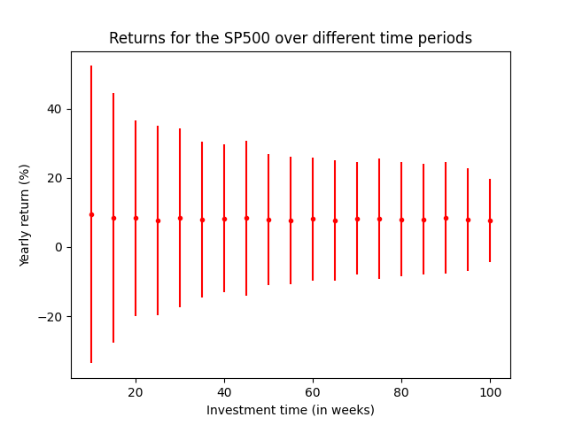
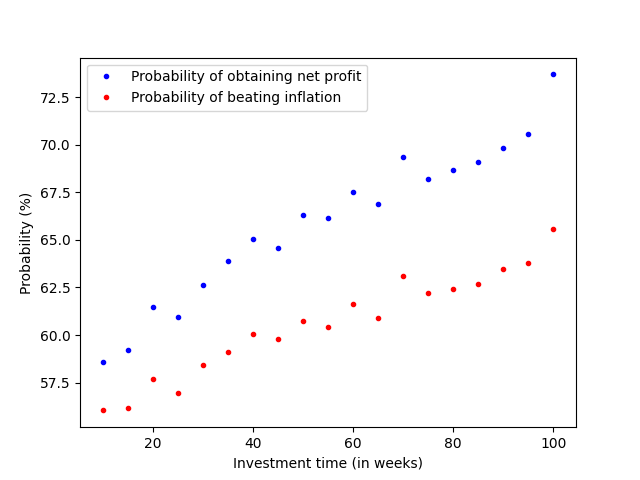

# Visualization of SP500 rentability and risk analysis

The general public have a conception of the stock market as a highly chaotic and risky option to obtain rentability from savings. However, if one takes only into account the evolution of one of the most representatives indixes, the SP500, a straightforward analysis will show that on average any given inversion should expect a return of around the 8%. **How much true is there in this two apparently contradictory situations?**

The general consensus is that in short periods of time there is not a clear way of predicting rentability of a given investment but if this investment persist long enough this rentability should steadily tent to this 8%. In this repository, we will try to put light on this notion.

### Date format

The date format used from now on will be the ISO standard where, for example, the 23th if October of 1996 would be written as 1996-10-23.

## Data and analysis

For the following study, we have taken data from the SP500 since 1985-01-01 to 2022-12-31 using the yfinance package. Using this data we have taken the returns for different time periods and compute in this periods the expected yearly mean return $\mu$ and its associated standard deviation $\sigma$.

Finally, using a normal aproximation we have computed the probability of obtaining a rentability above a given threshold $r_{min}$. In this study we have selected two values for this threshold.

* **Case 1**: $r_{min} = 0.000$
   
    Using this threshold we obtain the probability of obtaining a net profit in our inversion.

* **Case 2**: $r_{min} = 0.028$

    Using this threshold we obtain the probability of obtaining a net profit above the average yearly inflation.

## Results

The main results of our study are presented below.

The mean yearly return is analogous and yields a mean of around the 8% independently of the investment time. However the standard deviation is reduced as time increase.

The probability of obtaining a net profit and beating inflation is increased as one inversor stays in the market.

## Conclusions

From our results, we can confirm that returns made in small time periods tend to be far more risky as are subject to big standard deviations. However, staying invested in the market for a long period results in a drastical disminution of risk.

##### Aridai Bordón 2023.